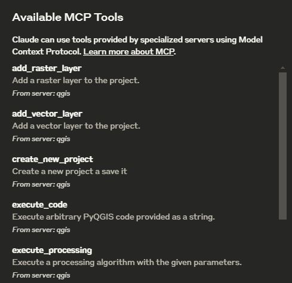

# QGISMCP - QGIS Model Context Protocol Integration (updated version from https://github.com/jjsantos01/qgis_mcp)

QGISMCP connects [QGIS](https://qgis.org/) to [Claude AI](https://claude.ai/chat) through the Model Context Protocol (MCP), allowing Claude to directly interact with and control QGIS. This integration enables prompt assisted project creation, layer loading, code execution and more.

The main project based on the (https://github.com/jjsantos01/qgis_mcp). I am just updating some error that i found

This project is strongly based on the [BlenderMCP](https://github.com/ahujasid/blender-mcp/tree/main) project by [Siddharth Ahuja](https://x.com/sidahuj)

## Features

- **Two-way communication**: Connect Claude AI to QGIS through a socket-based server.
- **Project manipulation**: Create, load and save projects in QGIS.
- **Layer manipulation**: Add and remove vector or raster layers to a project.
- **Execute processing**: Execute processing algorithms ([Processing Toolbox](https://docs.qgis.org/3.40/en/docs/user_manual/processing/toolbox.html)).
- **Code execution**: Run arbitrary Python code in QGIS from Claude. Very powerful, but also be very cautious using this tool.

## Components

The system consists of two main components:

1. **[QGIS plugin](/qgis_mcp_plugin/)**: A QGIS plugin that creates a socket server within QGIS to receive and execute commands.
2. **[MCP Server](/src/qgis_mcp/qgis_mcp_server.py)**: A Python server that implements the Model Context Protocol and connects to the QGIS plugin.

## Installation

### Prerequisites

- QGIS 3.X (only tested on 3.22 and 3.34)
- Cloud desktop
- Python 3.10 or newer
- uv package manager:

If you're on Mac, please install uv as

```bash
brew install uv
```

On Windows Powershell

```bash
powershell -ExecutionPolicy ByPass -c "irm https://astral.sh/uv/install.ps1 | iex"
```

Otherwise installation instructions are on their website: [Install uv](https://docs.astral.sh/uv/getting-started/installation/)

**⚠️ Do not proceed before installing UV**

### Download code

Download this repo to your computer. You can clone it with:

```bash
https://github.com/syauqi-uqi/qgis_mcp_modify1.git
```

### QGIS plugin

You need to copy the folder [qgis_mcp_plugin](/qgis_mcp_plugin/) and its content on your QGIS profile plugins folder.

You can get your profile folder in QGIS going to menu `Settings` -> `User profiles` -> `Open active profile folder` Then, go to `Python/plugins` and paste the folder `qgis_mcp_plugin`.

> On a Windows machine the plugins folder is usually located at:
    `C:\Users\USER\AppData\Roaming\QGIS\QGIS3\profiles\default\python\plugins` and on MacOS:
    `~/Library/Application\ Support/QGIS/QGIS3/profiles/default/python/plugins`

 Then close QGIS and open it again. Go to the menu option `Plugins` -> `Installing and Managing Plugins`, select the `All` tab and search for "QGIS MCP", then mark the QGIS MCP checkbox.

### Claude for Desktop Integration

Go to `Claude` > `Settings` > `Developer` > `Edit Config` > `claude_desktop_config.json` to include the following:

> If you cann't find the "Developers tab" or the `claude_desktop_config.json` look at this [documentation](https://modelcontextprotocol.io/quickstart/user#2-add-the-filesystem-mcp-server).

```json
{
    "mcpServers": {
        "qgis": {
            "command": "uv",
            "args": [
                "--directory",
                "#change this line to your directory#",
                "run",
                "qgis_mcp_server.py"
            ]
        }

    }
}
```

## Usage

### Starting the Connection

1. In QGIS, go to `plugins` -> `QGIS MCP`-> `QGIS MCP`
    
2. Click "Start Server"
    

### Using with Claude

Once the config file has been set on Claude, and the server is running on QGIS, you will see a hammer icon with tools for the QGIS MCP.



#### Tools

- `ping` - Simple ping command to check server connectivity
- `get_qgis_info` - Get QGIS information about the current installation
- `load_project` - Load a QGIS project from the specified path
- `create_new_project` - Create a new project and save it
- `get_project_info` - Get current project information
- `add_vector_layer` - Add a vector layer to the project
- `add_raster_layer` - Add a raster layer to the project
- `get_layers` - Retrieve all layers in the current project
- `remove_layer` - Remove a layer from the project by its ID
- `zoom_to_layer` - Zoom to the extent of a specified layer
- `get_layer_features` - Retrieve features from a vector layer with an optional limit
- `execute_processing` - Execute a processing algorithm with the given parameters
- `save_project` - Save the current project to the given path
- `render_map` - Render the current map view to an image file
- `execute_code` - Execute arbitrary PyQGIS code provided as a string

### Example Commands

This is the example I used for the [demo](https://x.com/jjsantoso/status/1900293848271667395):
Or, for this updated version, see (https://www.linkedin.com/posts/syauqi-arka-yudisti-73b236288_qgis-ai-vibemapping-activity-7316248625045483524-hQdB?utm_source=share&utm_medium=member_android&rcm=ACoAAEXNN58BLMyjf4iZIy1KZZJBUFyiNlLtNSg)

```plain
You have access to the tools to work with QGIS. You will do the following:
	1. Ping to check the connection. If it works, continue with the following steps.
	2. Create a new project and save it at: "C:/Users/USER/GitHub/qgis_mcp/data/cdmx.qgz"
	3. Load the vector layer: ""C:/Users/USER/GitHub/qgis_mcp/data/cdmx/mgpc_2019.shp" and name it "Colonias".
	4. Load the raster layer: "C:/Users/USER/GitHub/qgis_mcp/data/09014.tif" and name it "BJ"
	5. Zoom to the "BJ" layer.
	6. Execute the centroid algorithm on the "Colonias" layer. Skip the geometry check. Save the output to "colonias_centroids.geojson".
	7. Execute code to create a choropleth map using the "POB2010" field in the "Colonias" layer. Use the quantile classification method with 5 classes and the Spectral color ramp.
	8. Render the map to "C:/Users/USER/GitHub/qgis_mcp/data/cdmx.png"
	9. Save the project.
```

### Another Example Commands In my version


```plain
You have access to the tools to work with QGIS. You will do the following:

1. **Ping to check the connection**. If successful, proceed.  

2. **Create a new QGIS project** and save it to:  
   **"D:/PROJECT/MCP/claudemap.qgz"** (gunakan slash `/` untuk kompatibilitas).  

3. **Load vector layers**:  
   a. Load **"D:/PROJECT/MCP/map (2).osm"** (OSM layers akan terbagi menjadi `points`, `lines`, `multilinestrings`, `multipolygons`).  
   b. Load **"D:/PROJECT/MCP/Bahan_Mundupesisir/aoi.shp"** and name it **"aoi"**.  

4. **Zoom to the "aoi" layer** to set the initial extent.  

5. **Remove/hide unnecessary layers**:  
   a. Remove layer **"map (2) — points"** (klik kanan > Remove Layer).  
   b. Hide layer **"aoi"** (untuk mempertahankan extent tetapi tidak menampilkannya di peta).  

6. **Style layers**:  
   a. **"map (2) — lines"**:  
      - Line color: **#ff6201** (orange)  
      - Stroke width: **0.5 mm**  
   b. **"map (2) — multilinestrings"**:  
      - Line color: **#8bff07** (hijau neon)  
      - Stroke width: **0.8 mm**  
   c. **"map (2) — multipolygons"**:  
      - Fill color: **#fff65f** (kuning pucat)  
      - Stroke color: **#fff65f** (sama dengan fill)  
      - Stroke width: **0.3 mm**  
      - Transparency: **80%**  

7. **Create Print Layout (A4 Portrait)**:  
   a. Tambahkan **Map Item** dengan ukuran A4 (210x297 mm).  
   b. Set **scale to 1:10,000** and enable **"Lock layers for map item"**.  
   c. Tambahkan **Title**:  
      - Text: **"PETA MUNDUPESISIR BY CLAUDE.AI"**  
      - Font: **Bold, 24pt**  
      - Posisi: Atas tengah.  
   d. Tambahkan **Scale Bar** dan **Legend** (opsional).  

8. **Export to PNG**:  
   - Path: **"D:/PROJECT/MCP/claudemap.png"**  
   - Resolution: **600 DPI** (pastikan ukuran file tidak terlalu besar).  

9. **Save the QGIS project**.
```

